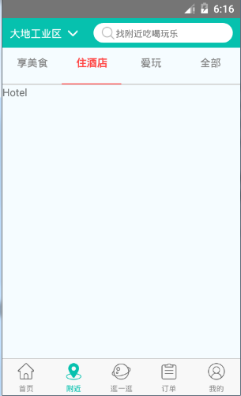
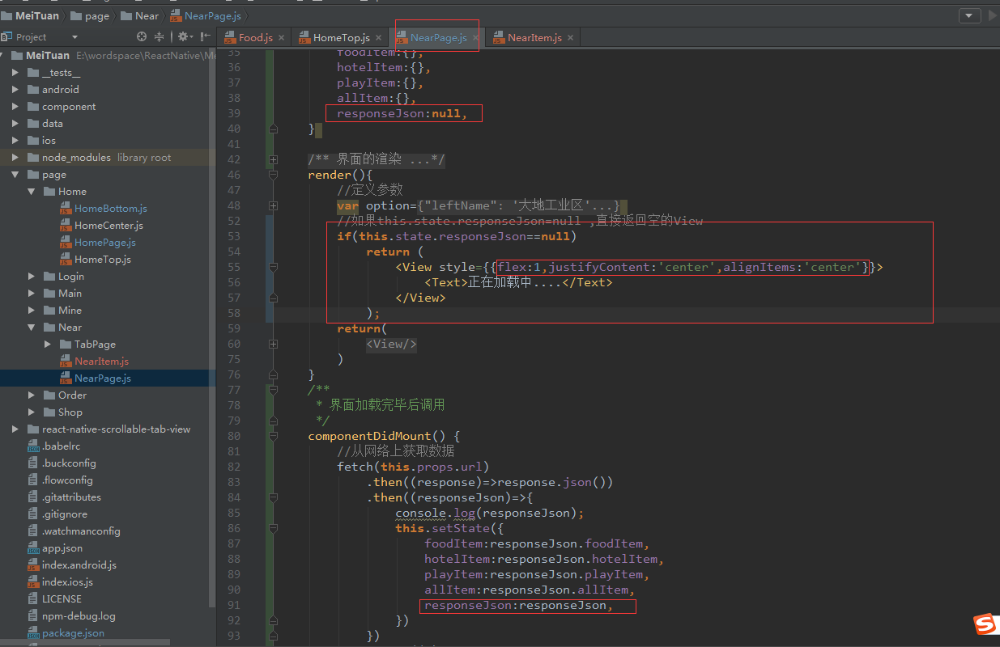
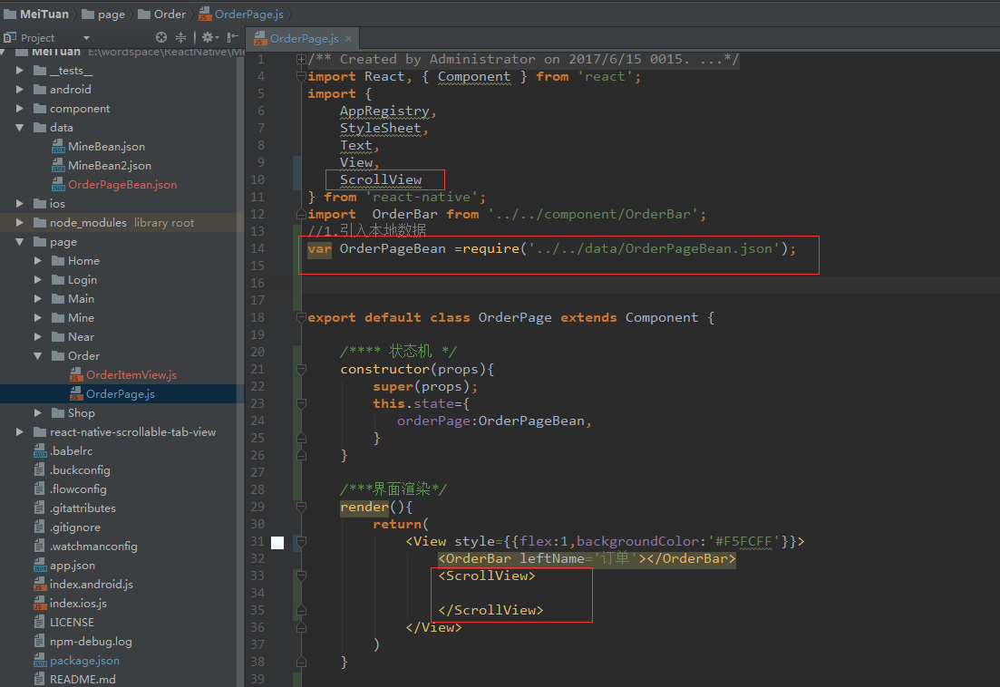

# 美团项目（三）

## 1.实现附近界面

### 1.安装react-native-scrollable-tab-view

**第一种方法（>=0.44版本）：**

https://github.com/skv-headless/react-native-scrollable-tab-view

在控制台进入美团项目的根目录，执行：npm install react-native-scrollable-tab-view --save


可以在项目的node_modules文件中查看是否引入成功(  下图是引入成功 )


**第二种方法（<0.44版本）：**

1.下载该框架的源代码：


2.下载0.6.1的版本


### 2.引用react-native-scrollable-tab-view


### 3.scrollable-tab-view的样式


```
   				<ScrollableTabView
                    tabBarBackgroundColor='#F5FCFF'
                    tabBarActiveTextColor='#FF4645'
                    tabBarInactiveTextColor='gray'
                    tabBarUnderlineStyle={{backgroundColor:'#FF4645',height:1}}
                >
                    <Text tabLabel='享美食'>My</Text>
                    <Text tabLabel='住酒店'>favorite</Text>
                    <Text tabLabel='爱玩'>project</Text>
                    <Text tabLabel='全部'>project</Text>

                </ScrollableTabView>
```

1.tabBarUnderlineStyle(style) 

 设置DefaultTabBar和ScrollableTabBarTab选中时下方横线的颜 色。 

 2.tabBarBackgroundColor(String) 

 设置整个Tab这一栏的背景颜色 

 3.tabBarActiveTextColor(String) 

 设置选中Tab的文字颜色。 

4.tabBarInactiveTextColor(String) 

设置未选中Tab的文字颜色。 


执行效果：


### 4.添加对应的Page

1.定义对应的Page组件


2.应用对应的Page组件


```
	 		<ScrollableTabView
                    tabBarBackgroundColor='#F5FCFF'
                    tabBarActiveTextColor='#FF4645'
                    tabBarInactiveTextColor='gray'
                    tabBarUnderlineStyle={{backgroundColor:'#FF4645',height:1}}
                >
                    <Food tabLabel='享美食'></Food>
                    <Hotel tabLabel='住酒店'></Hotel>
                    <Play tabLabel='爱玩'></Play>
                    <All tabLabel='全部'></All>

                </ScrollableTabView>
```

3.执行效果图





### 5.实现Food中的列表

#### 1.开始网络请求获取数据

1.发起网络请求

```
http://47.93.30.78:8080/MeiTuan/near
```


2.查看请求的数据


#### 2.添加状态机保存数据


#### 3.实现food组件

1.初始化ListView


2.执行效果：


#### 4.实现food组件的列表

##### **1.修改数据源**


执行效果：


##### **2.美食对应的Item布局（定义一个NearItem组件）**


对应的样式


##### 3.使用NearItem组件


执行效果：


##### **4.完善NearItem组件的样式**

**1.图片和布局居中**


**2.实现右边的View布局**


布局对应的样式


**3.修改字体样式**


**4.给标题添加标签**


**5.设计点击事件**


### 6.Food组件添加头

#### **1.添加头部布局**


#### **2.头部布局实现函数**


#### **3.头部布局的样式**


#### **4.头部文字样式**

计算屏幕的宽度


头部文字的样式


#### **5.头部文字默认的选中第一个**

FF4346    white    gray


执行效果：


#### **6.实现其它的列表**


#### **7.优化组件，并添加加载中的提示**

修改NearPage组件



修改Food组件数据源初始化代码


#### 8.处理头部的点击事件


## 2.实现订单界面

### 1.数据的准备

#### 1.定义一个json文件


#### 2.在OrderPage中引入json文件



### 2.实现头部内容

#### 1.定义一个OrderItemView组件


#### 2.引入OrderItemView组件


#### 3.定义OrderItemBar组件


#### 4.引用OrderItemBar组件


#### 5.实现OrderItemBar布局


对应的样式


### 3.渲染最近订单内容


### 3.渲染最近流浪内容


### 4.设计点击事件


执行效果：


## 3.ScrollView的下拉刷新

### 1.添加下拉刷新监听事件


### 2.加载网络数据


```
http://47.93.30.78:8080/MeiTuan/order
```


执行的效果


## 4.打包发布

### 1.生成签名文件（meituan.jsk)

http://blog.csdn.net/developer_jiangqq/article/details/50525976/

1.点击Bulid选择Gererate Signed Apk 


2.点击创建签名文件（Create new ...） 

 

3.创建签名文件（meituan.jsk）

所有的密码都是：123456


4.创建成功：


5.附加说明：


### 2.将签名文件拷贝到Android项目

1.把刚刚生成的签名文件复制到项目android/app文件夹下面


2.然后进行修改项目中**gradle.properties**文件，进行添加如下的代码(注意下面的签名和别名的名称和上一步放入的meituan.jks要一样，下面两项分别填写签名和别名的密码

```
MYAPP_RELEASE_STORE_FILE=meituan.jks
MYAPP_RELEASE_KEY_ALIAS=meituan
MYAPP_RELEASE_STORE_PASSWORD=123456
MYAPP_RELEASE_KEY_PASSWORD=123456
```


3.给应用添加签名-配置局部应用Gradle文件

       直接在工程目录下得android/app/build.gradle中以下节点添加如下内容:

```
android {  
    ...  
    defaultConfig { ... }  
    signingConfigs {  
        release {  
             storeFile file(MYAPP_RELEASE_STORE_FILE)
             storePassword MYAPP_RELEASE_STORE_PASSWORD
             keyAlias MYAPP_RELEASE_KEY_ALIAS
             keyPassword MYAPP_RELEASE_KEY_PASSWORD
        }  
    }  
    buildTypes {  
        release {  
            ...  
            signingConfig signingConfigs.release 
        }  
    }  
}  
```


### 3.生成签名包

1.在控制台进入MeiTuan项目根目录 , 执行下面指令:cd android


2.在Android目录下执行下面的指令：gradlew assembleRelease


3.查看打包正式的apk


